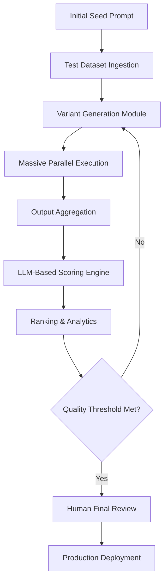

# Core Concept: Prompt Optimization Tool (POT)
## The Vision for Empirical Prompt Engineering

---

### 1. Title Page and Document Metadata

**Product Name:** Prompt Optimization Tool (POT)  
**Document Title:** Volume 1: Core Concept and Strategic Vision  
**Version:** 1.0.0 (Enterprise Specification)  
**Status:** Released for Implementation  
**Date:** April 2026  
**Target Audience:** CTOs, AI Architects, Product Leads, Lead Prompt Engineers, QA Directors  
**Classification:** Proprietary Technical Specification / Product Foundation  

---

### 2. Executive Summary

In the burgeoning era of Generative AI, the "Prompt" has emerged as the most critical yet most fragile component of the modern software stack. Organizations are rapidly integrating Large Language Models (LLMs) into their core workflows, yet the process of designing, testing, and refining the instructions that govern these models remains largely anecdotal, manual, and unscalable. The **Prompt Optimization Tool (POT)** is a production-grade orchestration platform engineered to solve this crisis of consistency.

POT transforms prompt engineering from a heuristic-based "vibe check" into a rigorous, data-driven engineering discipline. By combining advanced mutation algorithms, massive-scale execution, and high-fidelity "LLM-as-a-Judge" evaluation, POT enables teams to mathematically prove the superiority of their prompts. It doesn't just suggest better wording; it searches the high-dimensional space of potential instructions to find the global performance maximum for any given task.

This document serves as the foundational conceptual model for POT. It outlines the problem space, the product's core values, the philosophical approach to optimization, and the long-term vision for a self-healing AI instruction ecosystem.

---

### 3. Problem Statement: The Crisis of Consistency

#### 3.1 The Brittleness of Manual Prompting
Modern LLMs are hyper-sensitive to "semantic noise." A single character change—such as changing a colon to a period, adding a newline, or using the word "helpful" instead of "useful"—can shift the output's distribution by a significant margin. This brittleness is the primary obstacle to deploying AI in high-stakes environments like medical diagnosis, legal analysis, or financial auditing.

Current manual workflows involve a developer tweaking a prompt, testing it on 3-5 examples, and declaring it "ready." This approach fails to account for the "long tail" of edge cases. A prompt that works for 5 examples might fail for 5,000 others in production.

#### 3.2 The Lack of Objective Metrics
Traditional software testing relies on binary assertions (e.g., `assert(x == 5)`). AI outputs, being semantic, do not follow this pattern. Existing metrics like BLEU or ROUGE are designed for translation and summarization but fail to capture the "intent" or "logical correctness" of complex responses. Without a scalable way to measure "Quality," teams are flying blind.

#### 3.3 The "Local Maximum" Trap
Manual prompt engineering often hits a plateau. Once a prompt achieves ~80% accuracy, the marginal effort to reach 95% becomes exponentially high for a human. Developers often get stuck in a "local maximum," afraid to refactor the prompt structure (e.g., moving from few-shot to chain-of-thought) because they cannot easily verify the impact across their entire dataset.

#### 3.4 The Scaling and Migration Bottleneck
As the AI landscape evolves, models are replaced. Migrating from an older model (e.g., GPT-3.5) to a newer one (e.g., Llama 3) often breaks existing prompts. Organizations need a system that can "re-optimize" prompts for new architectures automatically, rather than requiring a total manual rewrite.

---

### 4. Why Prompt Optimization Matters: The Strategic Rationale

#### 4.1 The Economics of Token Efficiency
Every token generated has a cost and a latency penalty. Unoptimized prompts often result in "rambling" outputs or redundant conversational filler. By optimizing prompts to be concise yet precise, POT directly impacts the bottom line. A 20% reduction in output length across a million requests can save thousands of dollars monthly while improving user experience through faster response times.

#### 4.2 Reliability as the New Security
In the AI era, reliability is the most sought-after feature. A "reliable" prompt is one that:
1.  **Always** follows the requested format (e.g., JSON).
2.  **Never** leaks system secrets or falls for prompt injection.
3.  **Consistently** maintains the brand voice.
4.  **Accurately** processes diverse inputs without hallucination.

Optimization is the process of hardening these prompts against failure.

#### 4.3 Accelerating the "Idea-to-Production" Pipeline
The bottleneck in AI product development is no longer training the model—it's tuning the prompt. POT shortens the development lifecycle from weeks of manual "prompt hacking" to hours of automated optimization. This agility allows organizations to respond to market changes or model updates in real-time.

---

### 5. What the Tool Solves: Feature-to-Value Mapping

| Core Feature | Mechanism | Real-World Value |
| :--- | :--- | :--- |
| **Meta-Prompt Generation** | Uses LLMs to brainstorm variants of the original prompt. | Explores non-obvious strategies (e.g., XML tagging, persona shifting). |
| **Batch Orchestration** | Runs 100+ variants against 1,000+ test cases. | Provides a statistically significant performance baseline. |
| **LLM-as-a-Judge** | High-tier models grade the output of target models. | Scalable, human-like semantic evaluation 24/7. |
| **Multi-Objective Ranking** | Weighted scoring of Quality, Latency, and Cost. | Tailors the prompt to specific business priorities. |
| **Iterative Refinement** | Genetic algorithms evolve prompts over multiple generations. | Continually climbs the performance curve toward perfection. |
| **Comparison Heatmaps** | Visualizes which inputs cause which prompts to fail. | Identifies "weak spots" in the prompt's logic. |

---

### 6. Target Users and Personas

#### 6.1 The AI Architect (The Builder)
*   **Objective:** Design robust, multi-agent systems.
*   **Pain Point:** Orchestrating complex flows where one prompt's output is another's input.
*   **How POT Helps:** Validates that each node in the agentic chain is producing high-quality data.

#### 6.2 The Product Manager (The Visionary)
*   **Objective:** Ensure the AI reflects the company’s brand and user needs.
*   **Pain Point:** Cannot quantify "brand voice" or "empathy" in a technical way.
*   **How POT Helps:** Uses custom scoring rubrics to turn "vague feelings" into numerical scores.

#### 6.3 The QA Lead (The Gatekeeper)
*   **Objective:** Zero hallucinations and 100% safety compliance.
*   **Pain Point:** Manual testing doesn't scale to the infinite variety of LLM outputs.
*   **How POT Helps:** Automates adversarial testing (red-teaming) during the optimization process.

#### 6.4 The CFO / Operations Lead (The Optimizer)
*   **Objective:** Minimize inference costs and maximize ROI.
*   **Pain Point:** Ballooning API bills with no clear way to optimize usage.
*   **How POT Helps:** Ranks prompts by "Performance per Dollar," allowing for informed cost-cutting.

---

### 7. Core Product Principles

#### 7.1 Empirical Dominance
We believe that "good is what works." POT does not care if a prompt looks "ugly" or uses weird delimiters; if it produces a 98% accuracy score across 10,000 samples, it is the superior prompt.

#### 7.2 Provider Agnosticism
The prompt engineering layer should be decoupled from the model layer. POT treats all models as "inference endpoints" and ensures that the optimization logic remains consistent across OpenAI, Anthropic, Bedrock, and local vLLM deployments.

#### 7.3 Structural Transparency
The "Black Box" must be opened. POT logs not just the scores, but the *reasoning* behind every score and the *rationale* behind every variant generation. This creates an audit trail for AI behavior.

#### 7.4 Recursive Intelligence
We use AI to improve AI. The system itself learns which mutation strategies work for which domains (e.g., "Legal" vs. "Creative") and gets smarter with every optimization run.

---

### 8. High-Level System Behavior: The Orchestration Loop

The system operates as a continuous improvement engine. It doesn't just "run" a prompt; it manages a **Prompt Evolution Cycle**.

---

### 9. The Prompt Lifecycle: From Seed to Production

#### Step 1: The "Seed"
The user provides a draft prompt. This represents the "Human Intent." It might be messy or incomplete, but it defines the task boundaries.

#### Step 2: Test Case Selection
The user provides a dataset. POT supports "Dynamic Dataset Generation," where the tool itself creates synthetic test cases to cover edge cases the user might have missed.

#### Step 3: Mutation (The "Search")
The system generates variations. It might try:
*   **The "Expert" Persona:** "You are a PhD in History..."
*   **The "Delimited" Approach:** Using XML tags to separate inputs.
*   **The "Negative Constraint":** "Do NOT include a greeting."
*   **The "CoT" Approach:** "Think step by step before answering."

#### Step 4: Execution & Scoring
Each variant is run. The "LLM Judge" looks at the output.
*   **Input:** "Translate this to French."
*   **Output:** "Bonjour..."
*   **Judge's Question:** "Is this grammatically correct French?"
*   **Judge's Score:** 0.95.

#### Step 5: Ranking & Pruning
Low-performing prompts are "pruned" (deleted). High-performing prompts are selected for the next round of "breeding."

---

### 10. Optimization Philosophy: The Search for the Global Maximum

#### 10.1 Prompting as a Search Problem
We view the space of all possible English instructions as a vast, multi-dimensional landscape. Most manual prompts are stuck in a valley. POT uses diversity-seeking algorithms to "tunnel" through the landscape and find the highest peak—the combination of words that triggers the model's internal weights most effectively.

#### 10.2 Evolutionary Strategies
POT uses a modified Genetic Algorithm (GA) approach:
*   **Selection:** Pick the top 10% of prompts.
*   **Crossover:** Combine the "Persona" of Prompt A with the "Output Formatting" of Prompt B.
*   **Mutation:** Randomly change a sentence or add a new constraint.

#### 10.3 The "Reward Function"
The success of optimization depends entirely on the Reward Function. POT allows users to define complex, multi-variable rewards:
`Reward = (0.6 * Accuracy) + (0.2 * Format_Adherence) - (0.1 * Latency_ms/1000) - (0.1 * Token_Cost)`

---

### 11. Scoring Philosophy: Moving Beyond String Matching

#### 11.1 Why String Matching Fails
In a world of generative models, there is no such thing as "The" correct answer. There are millions of valid ways to write a summary. String similarity metrics (Jaccard, Levenshtein) fail because they don't understand meaning.

#### 11.2 The "LLM Judge" Architecture
POT implements a "Hierarchy of Judges."
*   **The Specialist Judge:** A model prompted specifically to detect a single trait (e.g., "Safety Judge").
*   **The Generalist Judge:** A high-tier model (GPT-4o) that synthesizes all scores into a final grade.
*   **The Rationalizer:** The judge must explain its score. This "Explanation" is often more valuable than the number itself, as it tells the engineer exactly what to fix.

#### 11.3 Calibration and Ground Truth
To ensure the judge isn't "hallucinating" its scores, POT includes a **Judge Calibration Workflow**. The user manually scores 10 samples, and the system compares its scores to the user's. If the delta is high, the system automatically tunes the *Judge's prompt* to align with the human.

---

### 12. Ranking Philosophy: Multi-Objective Pareto Optimization

In enterprise software, "accuracy" is rarely the only goal.
*   **Scenario A:** A 99% accurate prompt that takes 10 seconds to respond.
*   **Scenario B:** A 95% accurate prompt that takes 1 second and costs 1/10th as much.

POT uses **Pareto Frontier Visualization**. It plots all prompt variants on a graph (e.g., Quality vs. Latency). Users can see which prompts are "optimal" for their specific needs. There is no single "best" prompt, only the best prompt for a specific set of trade-offs.

---

### 13. Comparison Philosophy: Behavioral Diffing

Traditional `diff` tools show you how code changed. POT's **Behavioral Diff** shows you how the *model's mind* changed.
*   **Visualizing Regressions:** If a prompt gets better at "Summarization" but worse at "Naming Entities," POT highlights this "Trade-off" clearly.
*   **Semantic Clustering:** POT clusters outputs to show if an optimized prompt is becoming more "monotone" or "creative" compared to the original.

---

### 14. Human-in-the-Loop: The "Expert Override"

Automation does not replace expertise; it scales it.
*   **The "Gold Standard" Dataset:** Experts curate a set of perfect examples. The system uses these as the "North Star."
*   **Interactive Refinement:** A user can look at a variant, say "I like this part, but change the tone," and the system will re-optimize from that point.
*   **Audit Gates:** No prompt can be moved to "Production" status without an explicit "Expert Sign-off."

---

### 15. Deep-Dive Case Study: The "Corporate Legal Assistant"

#### 15.1 The Problem
A global law firm needs to extract "Arbitration Clauses" from complex contracts. The original prompt (Seed) was: *"Find the arbitration clause in this contract."*

#### 15.2 The Baseline Performance
Tested against 200 contracts, the seed prompt had:
*   **Recall:** 62% (missed 38% of clauses).
*   **Precision:** 85% (sometimes extracted random paragraphs).
*   **Cost:** $0.02 per contract.

#### 15.3 The Optimization Run
POT generated 30 variants. After 3 iterations of evolutionary mutation:
*   **Winning Variant:** Used a "Double Check" technique: *"Step 1: Locate potential arbitration text. Step 2: Verify if the text mentions a specific venue (e.g., AAA, ICC). Step 3: Return only the verified text in JSON format."*

#### 15.4 The Final Result
*   **Recall:** 98%.
*   **Precision:** 99%.
*   **Cost:** $0.025 per contract (negligible increase).
*   **Business Impact:** Replaced 3 junior paralegals with a single automated dashboard.

---

### 16. Technical Implementation Rationale: Why This Approach?

#### 16.1 Distributed Orchestration vs. Local Scripts
Manual prompt tuning usually involves local Python scripts. POT uses a distributed architecture because scaling to 100,000+ executions requires industrial-grade queue management, rate-limiting, and state persistence that scripts cannot provide.

#### 16.2 Semantic Vector Search for Diversity
We use vector embeddings to ensure that variants are diverse. If a human writes variants, they tend to stay in the same semantic "neighborhood." POT's mutation engine is forced to explore far-flung regions of the instruction space, often discovering unconventional phrasing that a human would consider "unprofessional" but which the model understands perfectly.

---

### 17. Security, Ethics, and Governance

#### 17.1 The "Adversarial Prompting" Layer
Every optimized prompt is subjected to a "Red-Teaming" run. The system attempts to trick its own optimized prompt into violating company policies. If a prompt is found to be "vulnerable," its ranking is penalized, ensuring that "Performance" never comes at the cost of "Security."

#### 17.2 Bias Detection and Mitigation
POT includes a "Bias Evaluator" in its scoring rubric templates. This evaluator checks if the model's output varies based on sensitive attributes (e.g., gender, race) in the input data. If bias is detected, the system alerts the user and suggests constraints to neutralize the model's response.

---

### 18. Product Boundaries and Future Vision

#### 18.1 What POT is NOT
*   **Not a RAG Engine:** We don't manage your vector database, but we optimize how your retrieved context is presented to the LLM.
*   **Not a Model Provider:** We are the intelligence layer that sits on top of your existing cloud or local models.

#### 18.2 The Vision: Self-Healing Prompts
Our long-term goal is to integrate POT with production monitoring. When a production model's performance on live traffic starts to decay (due to model drift), POT will automatically launch an optimization job in the background and suggest a "Patch" to the prompt, ensuring the application remains at peak performance indefinitely.

---

### 19. Risks and Strategic Limitations

*   **Computational Expense:** Large-scale optimization is not free. It consumes significant API credits.
*   **The "Overfitting" Risk:** Just as in machine learning, a prompt can be over-optimized for a specific test set. POT mitigates this through "Cross-Validation" datasets that the prompt is tested on after optimization.

---

### 20. Conclusion

The **Prompt Optimization Tool** represents the next evolution in AI software development. By moving from a world of "vibe-based" prompting to "measurement-based" engineering, we provide the foundation for robust, enterprise-ready AI. POT is the essential toolkit for any organization that treats its AI interactions as mission-critical software.

---
*Document Ends*
