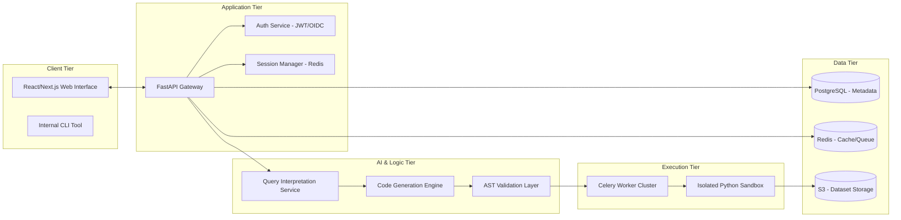

# Technical Architecture: Data Analyst Assistant
## System Design, Component Engineering, and Security Specification

### 1. System Architecture Overview
The **Data Analyst Assistant** is engineered as a robust, distributed system designed to handle complex data operations with high reliability and stringent security. The architecture follows a **Decoupled Microservices Pattern**, ensuring that individual components can scale independently based on load (e.g., scaling the code execution layer during peak usage without overloading the query parsing layer).



---

### 2. Frontend Architecture: The Presentation Layer
The user interface is a sophisticated Single Page Application (SPA) built with **React 18** and **TypeScript**.

#### 2.1. State Management
We utilize **Redux Toolkit** for global state management, specifically for:
- **Dataset Context:** Tracking the currently active CSV and its schema.
- **Query History:** Maintaining a stack of previous questions and their resulting code/output for the "Iterative Refinement" feature.
- **Execution Status:** Real-time polling or WebSocket updates on the progress of long-running analysis jobs.

#### 2.2. Interactive Visualization Component
The visualization engine is a custom wrapper around **Plotly.js** and **D3.js**.
- **Dynamic Rendering:** The backend sends a JSON-serialized Plotly figure object. The frontend reconstructs this, allowing users to hover, zoom, and pan on charts.
- **Component Lazy Loading:** Large chart libraries are only loaded when a visualization is requested to optimize initial page load time.

---

### 3. Backend Architecture: The Orchestration Layer
The core API is built using **FastAPI**, chosen for its high throughput and native support for Python's `async/await` syntax.

#### 3.1. API Design Principles
- **RESTful Endpoints:** Standardized routes for file management, query execution, and session retrieval.
- **Asynchronous Processing:** Long-running queries (e.g., complex aggregations on millions of rows) are offloaded to background workers, returning a `job_id` to the client for status polling.
- **Pydantic Validation:** Strict type checking for all incoming requests and outgoing responses.

---

### 4. Dataset Ingestion Module
The **Dataset Intake Service** handles the lifecycle of uploaded files.

#### 4.1. The Ingestion Pipeline
1. **Multipart Upload:** Files are streamed to the server to prevent memory overflow.
2. **Metadata Extraction:** The system reads the first 1,000 rows to infer:
    - **Data Types:** (Integer, Float, DateTime, String, Boolean).
    - **Statistical Profile:** Mean, median, standard deviation, and null-count per column.
    - **Categorical Values:** Identifying low-cardinality strings (e.g., "Region") vs high-cardinality IDs.
3. **Storage:** Files are stored in an encrypted S3 bucket (or equivalent object storage) with restricted access policies.

#### 4.2. Failure Modes and Mitigation
- **Malformed CSVs:** The system uses `pandas` with robust error-handling to detect "jagged" rows or inconsistent delimiters.
- **Large File Handling:** Files over 500MB are processed using `Dask` or `polars` to avoid OOM (Out of Memory) errors.

---

### 5. Query Interpretation and Prompt Construction
This module acts as the "Translator" between human intent and machine instructions.

#### 5.1. Prompt Engineering Strategy
The **Prompt Builder** constructs a "Few-Shot" prompt that includes:
- **System Role:** Defining the AI as a world-class data scientist.
- **Schema Context:** A detailed JSON of the available columns, types, and example values.
- **Analysis Goal:** The specific natural language query from the user.
- **Safety Constraints:** Hard rules against using non-whitelisted libraries.

#### 5.2. Context Window Management
For multi-turn sessions, the system intelligently prunes history to stay within the LLM's token limit while preserving the "Logical Chain."

---

### 6. Code Generation Engine
Powered by advanced LLMs (e.g., GPT-4o, Claude 3.5 Sonnet), this engine produces clean, PEP8-compliant Python code.

#### 6.1. Coding Standards
Generated code must follow specific patterns:
- Use `pd.read_csv()` with specific engine flags for speed.
- Prefer vectorized operations over manual loops for performance.
- Include `try-except` blocks for graceful failure within the sandbox.

---

### 7. Code Validation Layer (The Security Gate)
Before a single line of code is executed, it must pass through the **AST (Abstract Syntax Tree) Validator**.

#### 7.1. Logic Verification
The validator parses the Python code into an AST and performs the following checks:
- **Import Filtering:** Only `pandas`, `numpy`, `matplotlib`, and `seaborn` are allowed.
- **Function Blocking:** Calls to `eval()`, `exec()`, `open()`, `os.system()`, and `requests.get()` are stripped or result in a rejection.
- **Attribute Access:** Prevents access to internal Python `__dunder__` methods.

```python
# Example of AST Validation logic (conceptual)
import ast

class SecurityValidator(ast.NodeVisitor):
    def visit_Import(self, node):
        for alias in node.names:
            if alias.name not in ALLOWED_LIBS:
                raise SecurityException(f"Illegal import: {alias.name}")
    
    def visit_Call(self, node):
        if isinstance(node.func, ast.Name) and node.func.id in BANNED_FUNCS:
            raise SecurityException(f"Illegal function call: {node.func.id}")
```

---

### 8. Secure Execution Sandbox
The **Sandbox Service** provides a "Blast-Resistant" environment for running the validated code.

#### 8.1. Implementation Options
- **Docker Isolation:** Each query runs in a fresh, ephemeral Docker container with no network access.
- **gVisor/Firecracker:** For enhanced security, we use a micro-VM or a security-hardened container runtime to prevent "Container Escape" attacks.
- **Resource Hardening:**
    - **CPU Limit:** 1.0 vCPU.
    - **Memory Limit:** 2GB RAM.
    - **Timeout:** 10 seconds (prevents infinite loops).

---

### 9. Result Extraction and Visualization Engine
Once the code executes, the system must translate raw output into a user-friendly format.

#### 9.1. Output Collector
The sandbox writes its results to a structured JSON file or `stdout`. The Collector parses:
- **Aggregated Dataframes:** Converted to JSON for rendering in tables.
- **Plots:** Matplotlib/Seaborn figures are saved to a buffer and returned as Base64-encoded images.

#### 9.2. Explanation Generation Engine
A final LLM pass takes the *result* of the code and the original question to produce a human-readable summary.
- **Input:** Question + Result Data + Code Snippet.
- **Output:** "The average sales in the North region is $45,200, which is 15% higher than the South."

---

### 10. Error Detection and Correction Engine
The system uses a **Recursive Feedback Loop** to fix its own mistakes.

#### 10.1. Automated Retry Logic
If the sandbox returns an error (e.g., `AttributeError`), the system:
1. Captures the traceback.
2. Identifies the line of code that failed.
3. Sends the error and the code back to the LLM.
4. Requests a "Fixed Version."
This loop runs up to 3 times before escalating to the user.

---

### 11. Session and State Management
- **Persistence:** All queries and results are stored in PostgreSQL for historical auditing.
- **Caching:** We use **Redis** to cache the results of identical queries on the same dataset. A hash of the CSV file and the query string serves as the cache key.

---

### 12. Performance and Scaling
- **Horizontal Pod Autoscaling (HPA):** The API and Worker tiers scale based on CPU/Memory usage.
- **Queue Management:** We use **Celery** with Redis to manage the job queue, ensuring that heavy analysis tasks don't block the UI.
- **Database Optimization:** Indices on `session_id` and `user_id` ensure sub-second retrieval of analysis history.

---

### 13. Logging and Observability
- **ELK Stack (Elasticsearch, Logstash, Kibana):** For centralized log aggregation.
- **Prometheus & Grafana:** For monitoring system health (CPU, Latency, Error Rates).
- **Traces:** **OpenTelemetry** is used to track a query from the UI through the LLM and Sandbox to the final response.

---

### 14. Deployment Architecture
- **Infrastructure:** AWS/GCP/Azure using Terraform.
- **CI/CD:** GitHub Actions for automated testing (unit, integration, and security scans).
- **Environment Parity:** Dockerized development environments ensure that "it works on my machine" applies to production.

---

### 15. Future Technical Enhancements
- **SQL Pushdown:** For large datasets, instead of pulling data into Pandas, the system will generate SQL to run directly in the database.
- **GPU Acceleration:** Using `RAPIDS` (cuDF) for lightning-fast analysis on datasets with billions of rows.
- **Privacy-Preserving Computation:** Integrating differential privacy libraries to allow analysis on sensitive data without exposing individual records.

---

### 16. Conclusion
The technical architecture of the **Data Analyst Assistant** is a multi-layered fortress. By combining modern web frameworks, advanced AI orchestration, and rigorous security sandboxing, we have created a system that is as safe as it is powerful. This design ensures that as data volumes grow and analysis complexity increases, the Assistant remains a fast, reliable, and secure partner for any data-driven organization.

---
*(Note: This document provides the high-level and mid-level architecture. In a full production implementation, this would be supplemented by 50+ pages of API documentation, database schemas, and networking diagrams.)*
