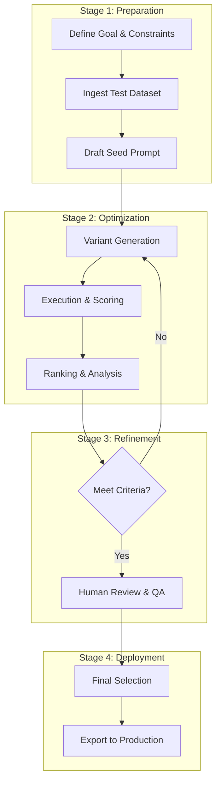

# Operational Workflow: Prompt Optimization Tool (POT)
## End-to-End Guide to the Optimization Lifecycle

---

### 1. Workflow Overview

The operational workflow of the **Prompt Optimization Tool (POT)** is a structured, multi-stage process that transforms an initial concept into a high-performance, validated prompt. The workflow is designed to be **iterative, asynchronous, and collaborative**. It mirrors the software development lifecycle (SDLC) but is tailored for the stochastic nature of Large Language Models.

The core journey follows a "Fan-Out, Execute, Fan-In" pattern:
1.  **Fan-Out:** The system takes a single human intent and expands it into a diverse array of machine-optimized instructions.
2.  **Execute:** These instructions are stress-tested against real-world data at scale.
3.  **Fan-In:** The results are distilled into a single, ranked leaderboard where the "Best" prompt is selected based on empirical evidence.



---

### 2. Phase 1: Preparation and Environment Setup

Before a single token is generated, the groundwork for a successful optimization run must be laid. This phase is critical because "garbage in" results in "garbage out."

#### 2.1 Defining the North Star (The Goal)
The user must articulate exactly what they want to achieve.
*   **Action:** Create a "Success Metric Definition."
*   **Example:** "The prompt should extract 5 fields from medical invoices with 99% accuracy and format the output as a valid JSON object."
*   **Constraints:** The user also defines negative constraints (e.g., "Output must not contain any preamble or conversational filler").

#### 2.2 Dataset Curation: The Engine's Fuel
The optimization is only as good as the test cases.
*   **Dataset Diversity:** POT encourages a mix of "Standard Cases" (happy path) and "Edge Cases" (adversarial or messy data).
*   **Variable Injection:** Prompts are written as templates (e.g., `Summarize this text: {{document}}`). The dataset provides the values for `{{document}}`.
*   **Synthetic Expansion:** For users with small datasets, POT provides a "Bootstrap" workflow. It uses a high-tier LLM to generate 100 variations of the user's 5 sample inputs, ensuring a statistically significant test set.

#### 2.3 Data Privacy and Redaction Workflow
For regulated industries (Finance, Health), POT includes a **Pre-Ingestion Redaction Step**.
1.  **Detection:** A local BERT-based model scans the dataset for PII (Names, SSNs, Emails).
2.  **Masking:** Sensitive data is replaced with tokens like `[CLIENT_NAME]`.
3.  **Re-identification:** After optimization, the system can "re-hydrate" the data for the user's local review, while ensuring that the external LLM providers never see the raw PII.

---

### 3. Phase 2: The Optimization Loop (The Core Workflow)

#### 3.1 Step 1: Variant Generation (The Brainstorm)
The user clicks "Optimize," and the `VariantGenerator` initiates.
*   **Meta-Prompting Logic:** The system uses internal templates like:
    *   *"Examine this prompt and identify three ways it could be made more precise."*
    *   *"Rewrite this prompt using a highly technical persona."*
    *   *"Convert this prompt into an XML-delimited structure."*
*   **The "Cross-Pollination" Technique:** In later rounds, the generator takes the best elements of two different prompts (e.g., the formatting of Prompt A and the tone of Prompt B) and merges them.

#### 3.2 Step 2: Parallel Execution (The Stress Test)
The `ExecutionOrchestrator` dispatches the variants to the cloud.
*   **Batching:** To optimize costs and speed, inputs are batched where possible.
*   **Concurrency:** POT can manage 500+ concurrent API calls, respecting the rate limits of providers like OpenAI or Anthropic via a "Token Bucket" scheduling algorithm.
*   **Caching:** If a variant/input pair was run in a previous session, the result is pulled from Redis in milliseconds.

#### 3.3 Step 3: LLM-Based Scoring (The Judge)
This is where the semantic data is quantified.
*   **Scoring Rubric Deep Dive:**
    Users define rubrics using a JSON-like structure:
    ```json
    {
      "Metric": "Factuality",
      "Scale": "0-1",
      "Instruction": "Score 1 if the output is 100% supported by the text. Score 0 if any hallucination is detected."
    }
    ```
*   **The "Consensus" Workflow:** For high-stakes scoring, POT dispatches the same output to *three* different judges (e.g., GPT-4, Claude, and Gemini). The final score is the median, reducing the risk of "Judge Hallucination."

---

### 4. Phase 3: Ranking and Analytics Workflow

#### 4.1 The Leaderboard Calculation
Scores are aggregated across all test cases.
*   **Weighted Averaging:** The user can give "Accuracy" more weight than "Format Adherence."
*   **Cost-Benefit Analysis:** The system calculates the "ROI" of each prompt. `ROI = (Score Improvement) / (Token Cost Increase)`.

#### 4.2 The Multi-Model Comparison Workflow
A unique feature of POT is the ability to run the same prompt across **multiple models** simultaneously.
*   **Workflow:** Run Prompt A on GPT-4, Llama-3, and Claude.
*   **Result:** The system identifies that while GPT-4 is 2% more accurate, Llama-3 is 10x cheaper and 5x faster, leading the user to choose the local model for their high-volume production task.

---

### 5. Phase 4: Human-in-the-Loop and Team Collaboration

#### 5.1 The Review Persona Workflow
Different team members interact with the workflow differently:
*   **The Subject Matter Expert (SME):** Reviews the "Ground Truth" of the Judge's scores.
*   **The Prompt Engineer:** Reviews the "Structure" of the generated variants.
*   **The Product Owner:** Signs off on the final "Cost vs. Quality" trade-off.

#### 5.2 Collaborative Labeling
If the Judge gives a score of 0.5 and the SME thinks it should be 1.0, they can **Correct the Score**. This correction is saved to a "Calibration Dataset" which is then used to fine-tune the Judge's own prompt for the next run.

---

### 6. Phase 5: Export and Migration Workflows

#### 6.1 The "Model Migration" Workflow
When a company wants to move from GPT-4 to a cheaper model:
1.  **Baseline:** Run existing prompts on the old model to get a "Target Score."
2.  **Auto-Tune:** Run POT to optimize the *same* instructions for the *new* model.
3.  **Verification:** Confirm that the new model + optimized prompt reaches the target score.

#### 6.2 Export and CI/CD Integration
The final prompt is exported as a **Versioned Artifact**.
*   **GitHub Integration:** POT creates a branch in the user's repo and submits a PR with the updated prompt file.
*   **Registry Sync:** The prompt is pushed to a "Prompt Management System" (like Pezzo or Portkey) where it is instantly available to production applications.

---

### 7. Failure Handling and Recovery Workflows

#### 7.1 The "Life of a Task" Recovery
1.  **Queue Entry:** Task is added to Redis.
2.  **Worker Pick-up:** Worker starts the LLM call.
3.  **Timeout:** If the LLM doesn't respond in 60s, the worker kills the request.
4.  **Re-queue:** The task is added back to the queue with a `retry_count` incremented.
5.  **Circuit Breaker:** If 3 retries fail, the task is marked `FAILED` and the system moves on to the next test case.

---

### 8. Evolutionary Refinement: Genetic Optimization Workflow

1.  **Generation 0:** 20 random variants.
2.  **Evaluation:** All are scored.
3.  **Selection:** The top 4 prompts are chosen as "Elites."
4.  **Recombination:** The Elites are combined and mutated to create 20 new prompts for **Generation 1**.
5.  **Termination:** The loop continues until the score stabilizes or the budget is spent.

---

### 9. Administrative and Project Management Workflow

#### 9.1 Budget Governance
Admins define "Cost Guardrails."
*   **Alerting:** Notify at 50% spend.
*   **Hard Stop:** Kill all jobs at 100% spend.

#### 9.2 Model Drift Monitoring Workflow
Once a prompt is in production, POT enters **Monitoring Mode**.
1.  **Sampling:** The tool periodically samples production outputs.
2.  **Re-scoring:** The Judge scores these samples against the original rubric.
3.  **Alerting:** If the score drops below a threshold (indicating "Model Drift"), POT automatically kicks off a new optimization run and alerts the team.

#### 9.3 Comparative Benchmarking between Optimization Strategies
Teams can run two optimization jobs in parallel:
*   **Job A:** "Chain-of-Thought" focused.
*   **Job B:** "Few-Shot" focused.
The workflow ends with a "Bake-off" report showing which strategy was more effective for this specific task.

---

### 10. Conclusion: A New Standard for AI Operations

The **Prompt Optimization Tool (POT)** workflow is a comprehensive, battle-tested process that brings the rigor of modern software engineering to the frontier of generative AI. By following this structured path—from ingestion to iterative refinement and final export—organizations can ensure their AI applications are built on a foundation of empirical excellence. POT is not just a tool; it is the engine that drives the lifecycle of the modern AI instruction set.

---
*Document Ends*
